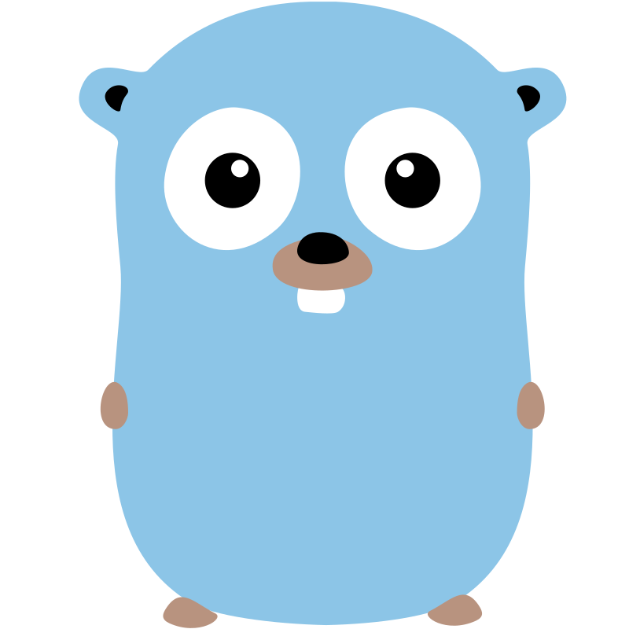
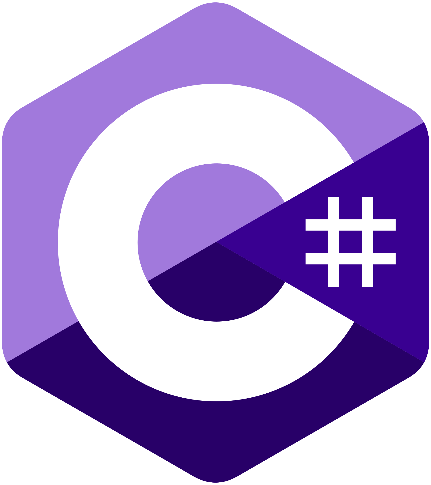
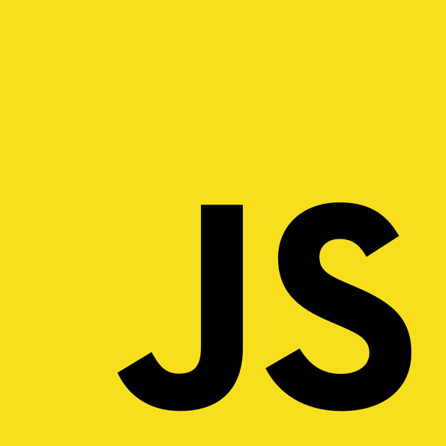
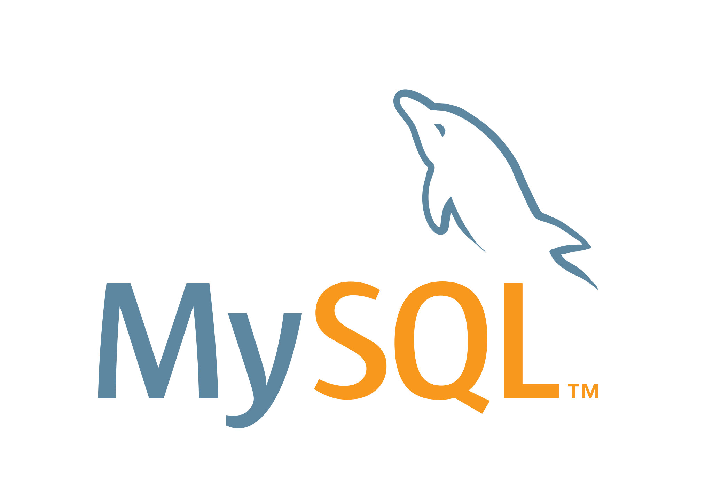

<h1 align="center">Hello, I'm Alexander 👨‍💻
</h1>
<h3 align="center">Software Developer from Russia</h3>

I'm a passionate software developer with experience in Golang, C#, Python, and Java. I enjoy tackling challenging problems and continuously learning new technologies. I regularly read documentation, books, and attend training sessions to stay updated with the latest industry trends.

## Languages & Tools

### Programming Languages

  
  
  
  
  
  

### Web Technologies

  
  
  

### Databases

  
  
  
  

### Version Control

  

## GitHub Analytics

  

  
  

## Contact Me

  

