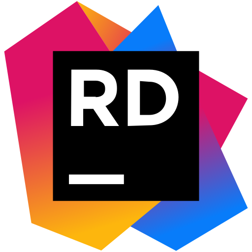

<h1 align="center">Hi there, I'm XE1A3R
</h1>
<h3 align="center">programmer from Russia</h3>

Программирую на C#, Python, Java.

Люблю интересные задачи. Стремлюсь осваивать новые технологии. Читаю мануалы, книги, просматриваю и посещаю тренинги.

    Discord server:
    

**Languages and tools:**

    

        
        
        
        
        
        
        
        
        
        
        
        
        
    

    

        
        
        
        
        
        
        
        
        
        
    

## Some of my Github Stats

